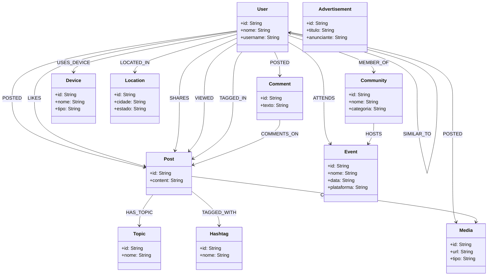

# X4Good - Banco de Dados em Grafos (Neo4j)

Este repositório contém o projeto de banco de dados em grafos para a plataforma X4Good, desenvolvido como trabalho prático para a disciplina de Banco de Dados em Grafos.

---

## 1. Descrição do Projeto

O sistema modela uma rede social focada em interações de usuários, publicações, comentários, mídias, tópicos, hashtags, eventos virtuais, dispositivos, localizações e anúncios direcionados. 

O banco de dados foi projetado no Neo4j para suportar consultas eficientes de relacionamentos complexos, incluindo um motor de recomendação inteligente que gera sugestões de amizades, conteúdos, comunidades e anúncios personalizados.

---

## 2. Modelo de Dados e Relacionamentos

### Entidades (Nós)
*   **User:** Representa os usuários da plataforma.
*   **Post:** Publicações criadas pelos usuários.
*   **Comment:** Comentários associados a publicações.
*   **Community:** Grupos temáticos.
*   **Topic:** Categoria geral do assunto dos posts.
*   **Hashtag:** Marcadores de conteúdo.
*   **Event:** Eventos virtuais organizados por comunidades.
*   **Device:** Dispositivo utilizado pelos usuários.
*   **Location:** Localização geográfica (Cidade/Estado) dos usuários.
*   **Media:** Arquivos multimídia (fotos/vídeos) anexados aos posts.
*   **Advertisement:** Campanhas de anúncios direcionados.

### Relacionamentos (Arestas)
*   `POSTED`: Relação de criação de posts, comentários ou mídias por um usuário.
*   `FOLLOWS`: Relação direcionada de seguimento entre usuários.
*   `FRIEND_OF`: Relação bidirecional de amizade mútua.
*   `LIKES`: Registro de curtida em posts, contendo reação e data.
*   `SHARES`: Compartilhamento de posts.
*   `COMMENTS_ON`: Associação de um comentário a uma publicação.
*   `MEMBER_OF`: Associação de um usuário a uma comunidade.
*   `TAGGED_IN`: Marcação de usuários em publicações.
*   `BLOCKED` / `MUTED`: Ações de bloqueio ou silenciamento entre usuários.
*   `VIEWED`: Log de visualizações de posts.
*   `SIMILAR_TO`: Similaridade de perfil calculada pelo sistema.
*   `HAS_TOPIC`: Associação de posts a tópicos de interesse.
*   `TAGGED_WITH`: Associação de posts a hashtags.
*   `USES_DEVICE`: Dispositivo utilizado pelo usuário.
*   `LOCATED_IN`: Localização geográfica do usuário.
*   `HOSTS`: Comunidade organizadora de um evento.

---

## 3. Diagrama do Grafo (Modelagem Lógica)

O diagrama abaixo representa a estrutura lógica do banco de dados em grafos da plataforma X4Good:

---

## 4. Instruções de Execução e Entrega

Os entregáveis exigidos para o trabalho prático estão estruturados na raiz do projeto:

1.  **Script de Criação do Banco:** O arquivo `criacao_e_povoamento.cypher` contém todas as queries necessárias para limpar, criar os esquemas e popular a base de dados com dados de teste estruturados.
2.  **Exportação do Diagrama:** O passo a passo para extrair o PNG do esquema diretamente do Neo4j Browser via `CALL db.schema.visualization()` está detalhado no arquivo `diagrama_modelo.md`.
3.  **Backup e Dump do Banco:** O manual detalhando como gerar o arquivo físico `.dump` a partir do Neo4j Desktop ou Neo4j AuraDB está localizado no arquivo `tutorial_backup.md`.
