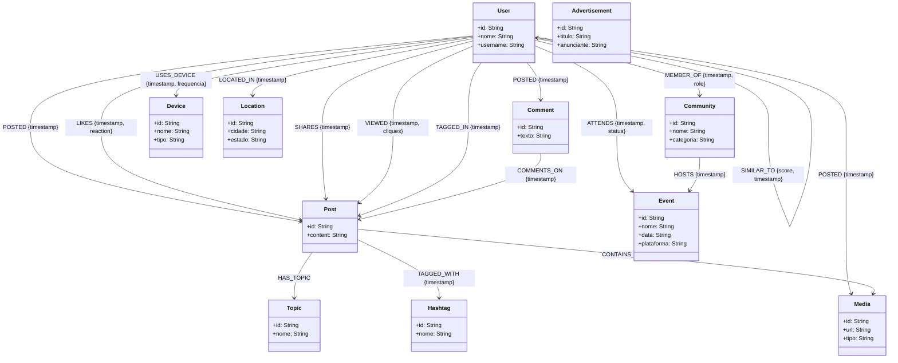

# Diagrama do Grafo e Modelo de Dados - X4Good

Este documento descreve o modelo lógico de dados em grafo para a rede social **X4Good** e como gerar a visualização oficial para entrega ao professor.

---

## 1. Diagrama de Relacionamento Lógico (Mermaid)

Você pode visualizar o diagrama abaixo diretamente no VS Code, no GitHub ou colar o código no site [Mermaid Live Editor](https://mermaid.live/) para exportar como imagem (PNG/SVG/PDF).



---

## 2. Como gerar e exportar o Diagrama do Neo4j (Recomendado para entrega)

O professor pediu o **diagrama do grafo referente ao banco criado**. A melhor forma é exportar diretamente a visualização do esquema do Neo4j.

Siga estes passos:

1. Abra o **Neo4j Browser** (local ou na nuvem AuraDB).
2. Na barra de comandos (topo), digite a seguinte consulta Cypher e clique em **Play/Executar**:
   ```cypher
   CALL db.schema.visualization()
   ```
3. O Neo4j gerará uma representação visual com todos os nós (User, Post, Location, etc.) conectados pelos seus respectivos relacionamentos.
4. No canto superior direito do painel de resultado do Neo4j Browser, clique no ícone **Export** (ícone de olho ou de seta/foto) e escolha **Export PNG** ou **SVG**.
5. Salve a imagem com o nome `diagrama_grafo_x4good.png` e adicione na pasta de entrega do seu trabalho.
